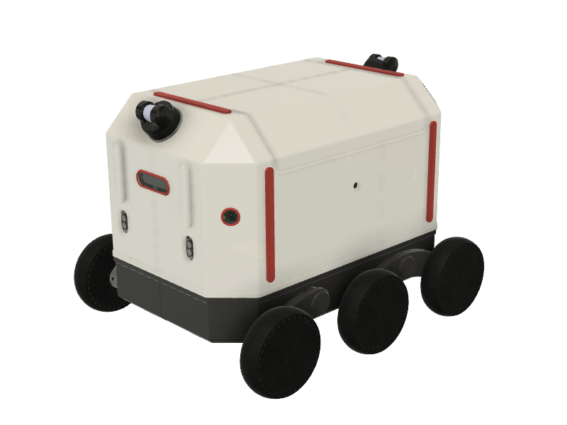
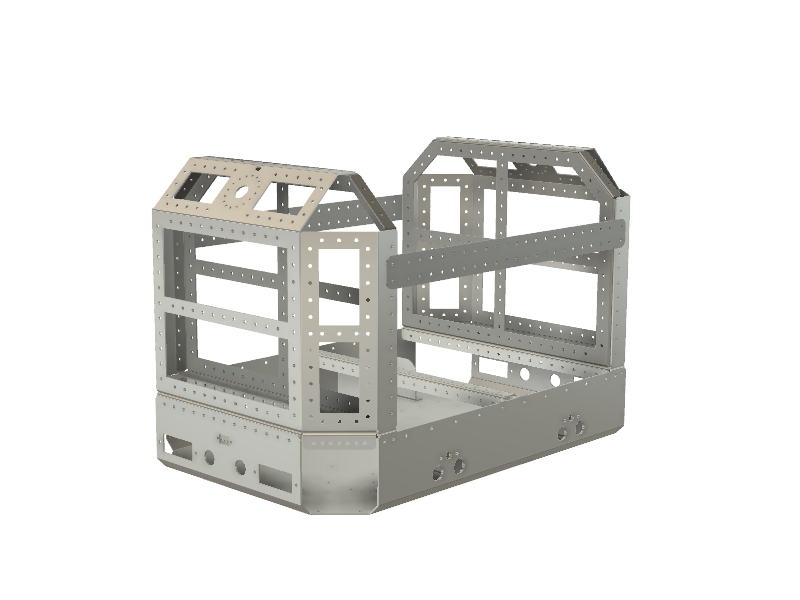

# ROVER6 Hardware

This repository contains all hardware documentation for my delivery robot project - ROVER6. It is not complete yet as I gradually add documentation here.

ROVER6 is a 6WD DIY delivery robot controlled with [ROS](https://www.ros.org). It is a hobby research robotic platform for building your own sidewalk delivery robot. Several principles were used when designing it:
1. Flexibility. You can change configuration of the platform by redesigning or just removing components for your particular purpuse.
2. Repeatability. ROVER6 is designed to use commonly available production technologies, like sheet metal cutting and bending, 3D printing. Electronic boards and components are mostly generally available in online stores but for several custom boards. But even those boards can be replaced with a set of generally available ones.
3. Wide range of technology to study. Building ROVER6 involves understanding of different mechanical production approaches, electronics, robotics, software and many more.

The project goal is to create a repeatable sidewalk delivery robot platform which can be teleoperated or operate autonomously in a simplified environment.

You can find videos describing the project progress on [my Youtube channel](https://www.youtube.com/@victorbelov8926).

### Frame

ROVER6 is built around a main frame which is created using laser cutting and bending 2mm sheet stainless steel. The frame is designed in a way to carry different components and supports changing them by providing a grid of mounting holes, so potentially any CPUs, sensors or whatever you need can be placed on the robot.

You will find 3 files for every part of the frame in the frame subfolder - a STEP 3D model, a DXF file for cutting and a PDF file with bending angles specification. There is also an assembly STEP file which contains all parts of the frame assembled.

### Enclosure and other 3D printed parts

TODO

### Electronics

TODO

### BOM

TODO

### Assembly

TODO

### License

This project is distributed under [Creative Commons CC BY-SA license](https://creativecommons.org/licenses/by-sa/4.0/)
